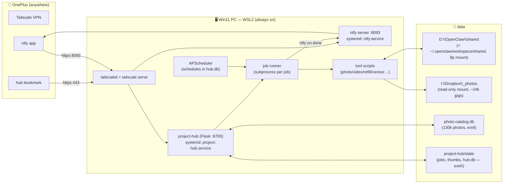
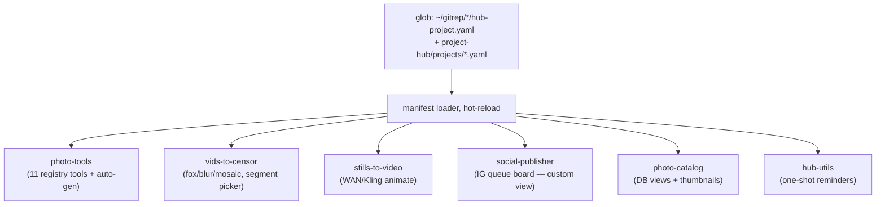
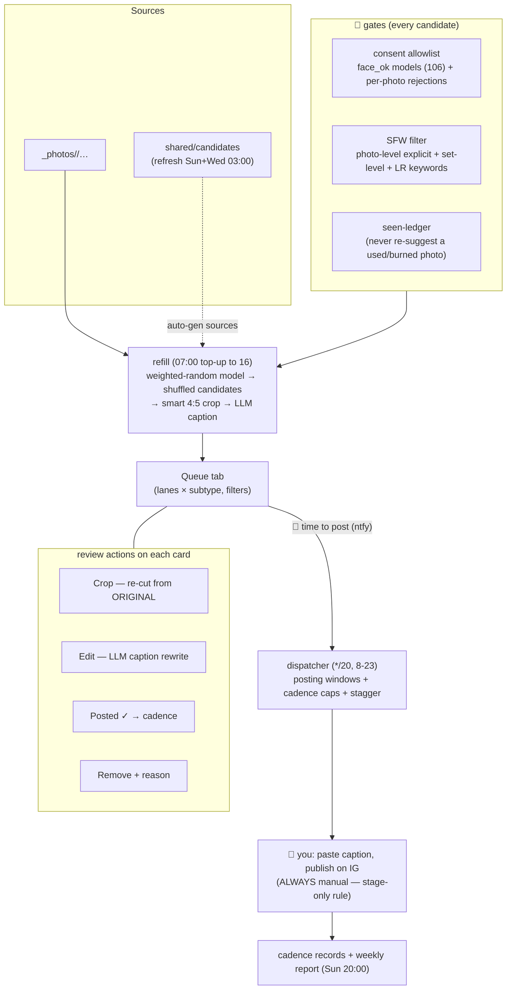
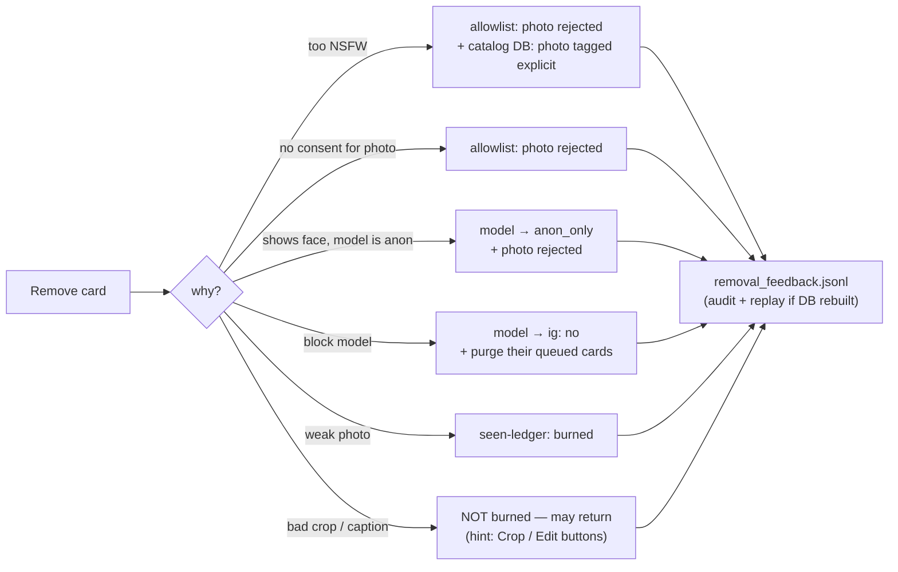

# project-hub — the content machine

One phone bookmark → every local media project. Runs on the always-on Win11 PC
(WSL2), reachable only over Tailscale. This file is the for-humans map; the
"Wiring" tab in the UI shows live state.

- **URL:** https://desktop-ddrctuq.tail4fbebb.ts.net (phone needs the Tailscale VPN on)
- **Notifications:** self-hosted ntfy, topic `hub-jobs`
- **Plan & history:** `~/.claude/plans/i-have-claude-code-enchanted-sun.md`

## 1. Bird's eye

**Rule of thumb for what lives where:** repos hold code + a `hub-project.yaml`
manifest; `shared/` holds media (visible from Windows Explorer); `state/` holds
regenerable runtime data on ext4 (SQLite corrupts on the 9p mounts); the catalog
DB is the photo brain.

## 2. Projects = manifests

Drop a `hub-project.yaml` in any repo → new project appears on refresh.
Manifest declares: content areas (gallery folders), actions (script + params →
auto-built forms), db views, notify topic. No hub code per project (single
sanctioned exception: `hub/ext/social_publisher.py`).

## 3. The IG content machine (daily loop)

## 4. Remove-with-reason: every removal teaches the system

## 5. Schedules (all visible/editable in the Schedules tab)

| When | What |
|---|---|
| every 20 min, 8–23 | posting dispatcher (notifies only when something is due) |
| 07:00 / 07:15 | top up RW1 posts / stories lanes to 16 |
| 03:00 Sun+Wed | refresh candidates pool |
| 20:00 Sun | weekly content report |
| 04:30 daily | purge >30-day trash |
| *(disabled)* | auto-gen (weighted by favorites, $1/day cap) |
| *(disabled)* | nightly auto-censor of vids-to-censor/input |

## 6. Ops crib sheet

- Everything auto-starts (systemd user units + linger). Reboot needs nothing.
- Backend code changed → `systemctl --user restart project-hub.service`.
  Manifests / tool scripts / registry → nothing (hot-reload / fresh subprocess).
- Logs: Jobs tab (per job), `journalctl --user -u project-hub`.
- Key backups to care about (small, priceless): `shared/data/consent_allowlist.yaml`,
  `photo-catalogging/data/photo-catalog.db`, `shared/favorites/favorites.json`,
  `shared/social-publisher/_state/*` — see "Ideas" below, backups are not automated yet.
